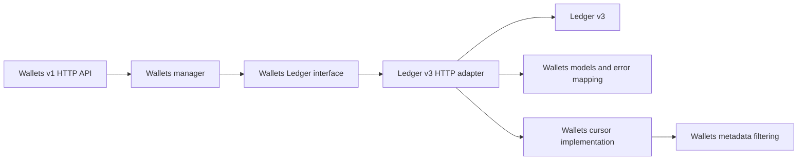

# Ledger v3 migration plan

## Status and scope

This document proposes the migration of Wallets from Ledger v2 to Ledger v3.
The target Wallets version supports Ledger v3 only. Runtime version detection,
fallback calls to Ledger v2, and a dual-protocol binary are outside the target
architecture.

The first migration keeps Wallets behavior and its public HTTP API stable as far
as possible. New Ledger v3 capabilities are evaluated separately after parity
has been demonstrated. In particular, the initial migration does not introduce
colored funds, account types, prepared queries, query checkpoints, or stored
Numscript references into Wallets behavior.

The plan covers:

- the Wallets code migration;
- compatibility verification;
- deployment on a newly provisioned Ledger v3 ledger;
- follow-up improvements enabled by Ledger v3.

Migrating existing Ledger v2 data is explicitly outside this plan. The target
deployment starts with a newly provisioned Ledger v3 ledger. This document does
not define a release date, infrastructure sizing, or a final
idempotency-retention policy.

## Compatibility goals

The migration must preserve:

- the Wallets v1 HTTP routes and response shapes;
- the existing chart of accounts and address generation;
- wallet, balance, hold, and transaction metadata keys;
- wallet and balance metadata filtering;
- balance priority and expiration behavior;
- credit and debit source selection;
- direct and pending debits;
- partial and final hold confirmation;
- hold cancellation and its redistribution to the original sources;
- transaction references;
- idempotent response and conflict behavior implemented by Wallets;
- forward and backward pagination exposed by Wallets;
- the error categories returned by Wallets.

The following differences are acceptable only when documented and tested:

- opaque v2 pagination cursors become invalid after the upgrade;
- Ledger v3 may provide more timestamp precision internally, while the Wallets
  response remains compatible;
- internal calls, metrics, traces, and errors use Ledger v3 concepts;
- list operations may have different latency because arbitrary user metadata
  cannot be queried in Ledger v3 without declaring and building an index.

## Current coupling

Wallets stores its state in one Ledger ledger and has no database of its own.
Accounts and account metadata represent wallets, balances, and debit holds.
Ledger transactions represent credits, debits, hold captures, and hold
cancellations.

The current `Ledger` interface is a useful boundary, but Ledger v2 SDK types
escape through it:

- `shared.V2Posting`;
- `shared.V2Volume`;
- `shared.V2Transaction`;
- `shared.V2TransactionsCursorResponseCursor`;
- `shared.V2PostTransactionScript`.

The integration also depends on Ledger v2 cursor and filter behavior. Replacing
the SDK calls without replacing these types and assumptions would leave Wallets
coupled to Ledger v2.

## Target architecture



The manager depends only on Wallets-owned models. The Ledger v3 adapter owns
the HTTP representation, Ledger error reasons, amount conversion, filtering,
and pagination translation.

The initial implementation uses Ledger v3's HTTP API. The HTTP surface exposes
all operations Wallets needs and does not require the gRPC protocol-version
contract. A later optimization can introduce gRPC for checkpoint-pinned reads
without changing the manager interface.

## Phase 0: establish the compatibility baseline

Start from the latest Wallets `main` branch. The current mainline includes
important behavior that must not be lost, including deterministic IDs for
idempotent creates, stored response snapshots, account validation, and Ledger
error mapping.

### Work

1. Inventory every public Wallets operation and its observable behavior.
2. Add characterization tests where the current suite does not fully specify
   behavior.
3. Record canonical JSON fixtures for wallets, balances, holds, transactions,
   pagination, and errors.
4. Identify fields that are intentionally variable, such as non-idempotent IDs
   and creation timestamps.
5. Record representative performance baselines for lists and wallet summaries.

### Required scenarios

- create and update a wallet;
- create and retrieve a balance;
- credit a specific balance;
- debit the main balance;
- debit an explicit ordered balance set;
- debit all balances through the wildcard selector;
- create, partially confirm, finally confirm, and cancel a hold;
- list wallets, balances, holds, and transactions with both cursor directions;
- filter wallets, balances, and holds by custom metadata;
- compute a wallet summary with active, expired, expirable, and held funds;
- replay idempotent operations with the same request;
- reuse an idempotency key with a different request;
- return insufficient-fund, not-found, validation, and conflict errors.

### Exit criteria

The suite describes the v2 behavior precisely enough that the same scenarios
can be executed against the v3 implementation and compared automatically.

## Phase 1: remove Ledger v2 types from the Wallets domain

Introduce Wallets-owned transport-neutral types. The exact structure can evolve
during implementation, but it must cover the following concepts:

```go
type LedgerPosting struct {
	Source      string
	Destination string
	Asset       string
	Amount      *big.Int
}

type LedgerVolume struct {
	Input   *big.Int
	Output  *big.Int
	Balance *big.Int
}

type LedgerAccount struct {
	Address  string
	Metadata map[string]string
	Volumes  map[string]LedgerVolume
}

type LedgerTransaction struct {
	ID                uint64
	Timestamp         time.Time
	Postings          []LedgerPosting
	Metadata          map[string]string
	Reference         string
	PostCommitVolumes map[string]map[string]LedgerVolume
}
```

Update the manager, holds, transactions, and list response mapping to use these
types. Keep every Ledger v3 wire conversion inside the adapter.

Do not change the public Wallets transaction JSON while replacing the embedded
Ledger v2 transaction. Preserve the current fields and their omission rules by
implementing an explicit Wallets response model.

### Exit criteria

- No Ledger v2 SDK model crosses the `Ledger` interface.
- Manager tests use Wallets-owned models.
- Existing public JSON fixtures remain unchanged.

## Phase 2: implement the Ledger v3 adapter

The adapter must support the following operations:

| Wallets need | Ledger v3 HTTP operation |
|---|---|
| Check a ledger | `GET /v3/{ledger}` |
| Create a ledger | `POST /v3/{ledger}` |
| Create a transaction | `POST /v3/{ledger}/transactions` |
| Save account metadata | `POST /v3/{ledger}/accounts/{address}/metadata` |
| Get an account | `GET /v3/{ledger}/accounts/{address}` |
| List accounts | `GET /v3/{ledger}/accounts` |
| List transactions | `GET /v3/{ledger}/transactions` |
| List ledger indexes | `GET /v3/{ledger}/indexes` |
| Create an index | `POST /v3/{ledger}/indexes` |
| Check index status | `GET /v3/{ledger}/indexes/{canonicalId}/status` |

### HTTP client requirements

- Reuse the injected HTTP client and its authentication transport.
- Honor request cancellation and deadlines.
- Encode ledger names, account addresses, metadata keys, and canonical index
  IDs as path segments.
- Apply bounded response-body decoding.
- Include `Idempotency-Key` only when Wallets has a non-empty key.
- Preserve Ledger correlation information in structured logs without exposing
  metadata or credentials.
- Separate transport failures from Ledger business errors.

### Amounts and timestamps

Ledger v3 exposes 256-bit unsigned amounts. Decode them into `big.Int` without
passing through `uint64`. Reject negative or malformed values before sending a
request. Add boundary tests above 64 bits and at the 256-bit limit.

Ledger v3 timestamps use microsecond storage and reject dates before the Unix
epoch on its public representation. Reject newly supplied incompatible
timestamps with a Wallets validation error.

### Metadata

Ledger v3 metadata is typed. Wallets remains string-oriented in the initial
migration:

- send Wallets metadata as strings;
- accept string values on reads;
- treat a non-string value in a Wallets-owned metadata key as incompatible
  data and surface a diagnostic error;
- do not silently stringify arbitrary typed values.

This prevents Wallets from changing the meaning of data written by another
client.

### Colors

Wallets initially supports only the uncolored Ledger v3 bucket. Transaction
postings sent by Wallets use an empty color. Account and transaction responses
must reject non-empty colors on Wallets-managed accounts rather than summing
them: summing would expose a balance that the existing Numscript sources cannot
spend as one fungible amount.

### Error mapping

Map Ledger v3 reasons to existing Wallets domain errors. At minimum, cover:

| Ledger v3 reason | Wallets handling |
|---|---|
| `LEDGER_NOT_FOUND` | Initialization or dependency error |
| `ACCOUNT_NOT_FOUND` | Wallet, balance, or hold not found |
| `INSUFFICIENT_FUNDS` | `INSUFFICIENT_FUND` |
| `VALIDATION` | Wallets validation error |
| `TRANSACTION_REFERENCE_CONFLICT` | Conflict |
| `IDEMPOTENCY_KEY_CONFLICT` | Idempotency conflict |
| `INDEX_NOT_FOUND` | Dependency configuration error |
| `INDEX_BUILDING` | Retryable dependency state |
| `UNAVAILABLE` | Retryable dependency state |

Match on the stable Ledger reason, not an inferred error kind or human message.

### Retry policy

Retry reads for retryable network failures, HTTP 429, and HTTP 503 within the
request deadline. Retry writes only when they carry a non-empty idempotency key.
Honor `Retry-After` and use bounded exponential backoff with jitter.

### Exit criteria

Contract tests verify method, path, query, headers, body, response mapping, and
errors for every adapter operation.

## Phase 3: initialize and validate the Ledger contract

`Manager.Init` currently ensures that the ledger exists. With Ledger v3 it must
validate the complete dependency contract.

### Required indexes

The current Wallets access patterns require these transaction indexes:

- `TX_BUILTIN_INDEX_ADDRESS` for wallet transaction lists;
- `TX_BUILTIN_INDEX_DESTINATION_ADDRESS` for locating the transaction that
  created a hold before cancellation.

Do not add an index for every custom metadata key. The set is controlled by API
callers and can grow without bound.

### Initialization behavior

For a newly provisioned environment:

1. Get the target ledger.
2. Create it if it is absent.
3. List its indexes.
4. Create missing required indexes idempotently.
5. Wait for their ready state within a configured startup timeout.
6. Expose Wallets readiness only after the contract is satisfied.

Initialization must fail with a precise diagnostic if the ledger exists in an
incompatible mode or if required indexes cannot become ready. It must not
silently recreate or delete existing configuration.

### Exit criteria

- Fresh-environment initialization is idempotent.
- Missing, building, ready, and incompatible index states are tested.
- Wallets never becomes ready against an incompatible ledger or incomplete
  indexes.

## Phase 4: preserve list filtering and pagination

Ledger v3 uses `after`, `pageSize`, and `reverse`. Wallets exposes opaque
`next` and `previous` cursors and supports arbitrary custom metadata filters.

### Metadata-filter strategy

The parity implementation filters metadata in Wallets:

1. Read an ordered page of candidate accounts from Ledger v3.
2. Apply the Wallets entity discriminator and caller metadata filters.
3. Continue reading until `limit + 1` matching entities are found or the
   Ledger sequence is exhausted.
4. Return `limit` entities and use the look-ahead match to determine `hasMore`.

This keeps arbitrary metadata keys working without dynamically provisioning
unbounded indexes. It has an explicit performance cost, which must be measured
and bounded.

Use the same approach for internal account metadata discriminators unless an
address-only selection is proven equivalent for the resource. Do not assume
that every account in the ledger belongs to Wallets.

### Cursor format

Use a versioned Wallets cursor whose decoded payload contains:

```json
{
  "version": 1,
  "resource": "wallets",
  "direction": "forward",
  "after": "wallets:example:main",
  "pageSize": 100,
  "filterHash": "sha256:..."
}
```

Serialize canonical JSON with URL-safe Base64. Validate every field and reject:

- unknown cursor versions;
- a cursor for another resource;
- invalid directions or page sizes;
- a cursor reused with filters different from its `filterHash`;
- invalid Ledger anchors.

For a previous page, scan in reverse from the first returned item and reorder
the selected items into the public Wallets order before returning them.

The implementation must distinguish the last scanned candidate from the last
returned match so skipped entities cannot cause duplicates or omissions.

### Safety limits

Configure and instrument:

- the internal Ledger page size;
- the maximum candidates scanned per Wallets request;
- the maximum Ledger pages fetched;
- the overall request deadline;
- scanned-to-matched ratio;
- pages read per returned item.

If a safety limit is reached before a complete Wallets page is known, return an
explicit error. Never return a page that falsely claims the result set ended.

### Transaction lists

The Wallets ledger is normally dedicated, but transaction selection must still
retain the Wallets transaction discriminator. If the Ledger v3 metadata query
would require an unbounded metadata index, apply the discriminator in Wallets
after using the address index when a wallet is specified. For the unscoped
transaction list, scan and filter with the same bounded algorithm.

### Exit criteria

- Forward and backward traversal returns each match exactly once.
- Sparse metadata matches work across multiple internal pages.
- Invalid and cross-query cursors return a validation error.
- Old Ledger v2 cursors fail cleanly after the upgrade.

## Phase 5: preserve writes and idempotency

Ledger v3 idempotency keys are global to the cluster. Namespace every key sent
by Wallets:

```text
wallets:<ledger>:<operation>:<incoming-key>
```

Examples:

```text
wallets:wallets-002:create-wallet:abc
wallets:wallets-002:debit:abc
wallets:wallets-002:confirm-hold:abc
```

Use a collision-safe encoding or hash for untrusted components. Never log the
full key.

Preserve Wallets' application-level protections:

- deterministic wallet IDs for idempotent wallet creation;
- deterministic hold IDs for idempotent pending debits;
- stored immutable create-wallet responses and request fingerprints;
- stored per-key create-balance responses;
- conflict on reuse with a different request;
- rejection of idempotent wildcard debits whose resolved sources can change;
- rejection when an expiring balance can change the source set between retries.

### Retention decision

Ledger v3 defaults to a 24-hour idempotency TTL and applies the policy at cluster
scope. Before production, record the current Wallets guarantee and choose one
of these deployments:

1. A non-expiring policy on a dedicated Ledger cluster.
2. A finite cluster policy at least as long as the documented Wallets contract.
3. Additional Wallets-owned durable deduplication if the cluster policy cannot
   satisfy the contract.

The third option is a separate design because Wallets currently has no database.
Do not silently accept the v3 default without making the API behavior explicit.

### Exit criteria

- Same-key/same-request retries return the original result.
- Same-key/different-request retries return a conflict.
- Raw keys cannot collide between operations or ledgers.
- Response-loss and retry scenarios are covered end to end.
- The production idempotency-retention decision is recorded.

## Phase 6: validate Numscript parity

Keep scripts inline for the initial migration. Execute every embedded script
against Ledger v3 without changing its intended movements:

- wallet credit;
- direct and pending debit;
- partial hold confirmation;
- final hold confirmation;
- hold cancellation.

The parity matrix includes:

- one and multiple sources;
- insufficient funds;
- `world` as a source;
- transaction and account metadata;
- amounts above 64 bits;
- explicit transaction references;
- explicit timestamps;
- partial and complete hold consumption;
- restitution to multiple original sources.

Hold cancellation requires the original transaction postings. The Ledger v3
transaction history created by Wallets must therefore remain queryable for as
long as its holds can remain open.

### Exit criteria

For each scenario, Ledger v2 and v3 produce equivalent postings, account
metadata, transaction metadata, references, and final uncolored volumes.

## Phase 7: test strategy

### Unit tests

Cover:

- Ledger v3 account and transaction conversion;
- 256-bit amounts;
- uncolored volume conversion and colored-fund rejection;
- unexpected typed metadata;
- error-reason mapping;
- cursor encoding, validation, traversal, and query binding;
- idempotency-key namespacing;
- retry classification and exhaustion.

### HTTP contract tests

Use a fake Ledger v3 HTTP server to assert:

- request methods and paths;
- encoded path segments;
- query filters and pagination parameters;
- request bodies;
- presence and absence of idempotency headers;
- successful and unsuccessful response shapes;
- 400, 404, 409, 429, 500, and 503 handling.

### Integration tests

Replace the Ledger v2/PostgreSQL test server with a real Ledger v3 server and
run the complete existing E2E suite. Add scenarios for:

- forward and backward pagination;
- sparse custom-metadata filters;
- an index still building;
- Wallets restart and idempotent replay;
- a lost write response followed by retry;
- namespaced-key isolation;
- colored funds on a Wallets-managed account;
- maximum supported metadata sizes and entries.

### Performance tests

Use representative distributions for wallets, balances, holds, transactions,
and metadata selectivity. Measure list latency, number of scanned candidates,
Ledger requests per Wallets request, and summary latency. Set production safety
limits from these results rather than arbitrary defaults.

## Phase 8: deploy on Ledger v3

This rollout provisions a new, empty Ledger v3 ledger. It does not import or
translate data from Ledger v2.

### Provisioning

1. Deploy the approved Ledger v3 release.
2. Create the Wallets ledger in normal mode.
3. Configure the required transaction indexes.
4. Wait until every required index is ready.
5. Configure Wallets with the Ledger v3 endpoint and credentials.
6. Deploy the Ledger-v3-only Wallets version with traffic disabled.

### Smoke tests

Run the following against the empty environment:

1. Verify readiness and server information.
2. Create a wallet and a secondary balance.
3. Credit and debit the wallet.
4. Create, retrieve, partially confirm, and cancel a hold.
5. List wallets, balances, holds, and transactions in both directions.
6. Exercise custom metadata filtering and wallet summaries.
7. Retry an idempotent request and verify the original response.
8. Reuse the same key with a different request and verify the conflict.

Enable traffic only after the smoke tests and observability checks pass. If the
deployment fails before traffic is enabled, remove it from service, correct the
configuration or implementation, and redeploy against a clean test ledger.

### Exit criteria

- The empty Ledger v3 ledger and required indexes are ready.
- The complete smoke-test sequence passes.
- Dashboards and alerts receive Wallets and Ledger signals.
- No Ledger v2 endpoint or credential is required by the deployment.

## Observability

Add or retain metrics for:

- Ledger request latency by operation;
- Ledger HTTP status and error reason;
- retries and retry exhaustion;
- idempotency conflicts;
- candidates scanned and matches returned;
- Ledger pages per Wallets request;
- cursor validation errors;
- missing and building indexes;
- colored-fund incompatibility;
- wallet-summary latency;
- rejected metadata and amounts.

Structured logs include the Wallets operation, ledger, Ledger status, stable
Ledger reason, correlation ID, and scan counters. They must not include OAuth
credentials, complete idempotency keys, or unredacted customer metadata.

Define alerts for sustained Ledger unavailability, index regressions, unusual
scan amplification, and rising error mappings.

## Pull request sequence

Implement the migration as reviewable, ordered pull requests:

1. Characterization tests and compatibility fixtures.
2. Wallets-owned Ledger models and interface cleanup.
3. Ledger v3 HTTP transport and error mapping.
4. Ledger v3 account metadata and transaction writes.
5. Ledger v3 account, volume, and transaction reads.
6. Wallets cursors and bounded application-side filtering.
7. Ledger initialization, indexes, and readiness.
8. Ledger v3 E2E suite and performance fixtures.
9. Deployment configuration and empty-environment smoke-test runbook.
10. Removal of Ledger v2 code and dependencies.
11. Separate, measured Ledger v3 improvements.

Each pull request must document its validation and remain narrowly scoped. The
Ledger-v3-only version is releasable only after items 1 through 10 are complete
and the empty-environment smoke tests have passed.

## Follow-up opportunities

After parity and production stability, evaluate these features independently:

| Ledger v3 capability | Potential Wallets use | Required evidence |
|---|---|---|
| Metadata indexes | Accelerate known high-value filters | Query distribution and bounded key set |
| Prepared queries | Prevalidate stable list or aggregation shapes | Repeated stable query patterns |
| Typed metadata | Query expiration and priority as native types | API compatibility design |
| Aggregate volumes | Reduce summary data transfer | Benchmark against required detailed response |
| Numscript library | Version fixed Wallets scripts | Deployment and version lifecycle |
| Query checkpoints | Consistent multi-read summaries | gRPC client and checkpoint lifecycle design |
| Account types | Enforce the Wallets chart of accounts | Chart compatibility analysis |
| Colored funds | Segregate balances by origin or purpose | Explicit Wallets product semantics |
| Ephemeral accounts | Reduce retained state for closed holds | History and audit requirements |

None of these capabilities should be bundled into the compatibility migration
without its own observable requirement and acceptance criteria.

## Final acceptance criteria

The migration is complete when:

- no Ledger v2 call or model remains in Wallets production code;
- the Wallets public OpenAPI contract remains compatible;
- the characterization and Ledger v3 E2E suites pass;
- all Numscript parity scenarios produce equivalent movements;
- forward and backward pagination are complete and duplicate-free;
- arbitrary custom metadata filters remain correct within documented safety
  limits;
- the idempotency retention policy is explicit and tested;
- the empty-environment deployment and smoke tests have succeeded;
- production dashboards and alerts are ready;
- module maintainers have reviewed and approved this document.

## Open decisions

The following decisions must be closed before production implementation is
considered ready:

1. Required idempotency retention and whether the Ledger cluster is dedicated.
2. Maximum acceptable scan amplification and latency for custom metadata
   filters.
3. Deployment ownership for ledger and index provisioning.
4. Production behavior when incompatible colored funds or typed Wallets
   metadata are detected.
